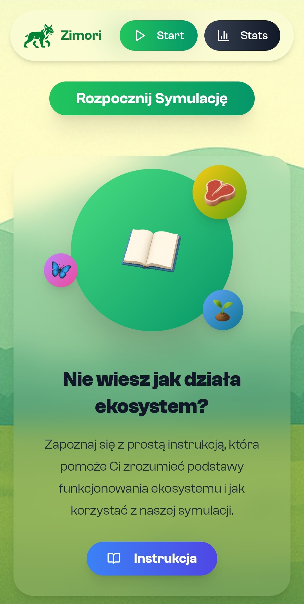

# Zimori - Ecosystem Simulation Web Application

<div align="center">
  
</div>

## Table of Contents
- 🚀 [Project Overview](#project-overview)
- ✨ [Features](#features)
- 💻 [Technologies](#technologies)
- 📋 [Requirements](#requirements)
- 🛠️ [Setup Instructions](#setup-instructions)
- 📸 [Screenshots](#screenshots)

## Project Overview
Zimori is a web application used to simulate ecosystems, in which users can manually adjust environmental properties in order to achieve balance. Each simulation takes place in real time, and users have access to statistics on the entire ecosystem and its individual objects.
> [!NOTE]  
> Zimori web application is only available in Polish language version!

## Features
- ⚙️ Simulation settings allowing you to adjust initial populations, grass spawn frequency, insect lifespan and much more
- 🌿 Real-time simulation visualization
- 📊 Access to statictics of current simulation and individual objects
- ⏯️ Ability to pause or manually end the simulation
- 🦋 19 different types of ecosystem objects with different characteristics
- 🎨 Simulation graphics mode with selectable appearance
- ❓ Comprehensive manual to help you understand the rules of the simulation
- 📝 Summary after each simulation showing the calculated state of the ecosystem, balance, survival rate, etc.
- 📈 Statistics for all simulations performed
- 📱 Full responsiveness

## Technologies
**Frontend**
- Next.js
- React
- Tailwind CSS
- Framer Motion
- Lucide


## Requirements
Software versions used for development:
- Next.js 15.2.4
- React 19.1.0
> [!WARNING]  
> Compatibility with earlier versions has not been tested.

## Setup Instructions
To run a project locally, you must have Node.js and npm installed. 
> [!IMPORTANT]  
> *Download guide: [Installing Node.js and npm](https://docs.npmjs.com/downloading-and-installing-node-js-and-npm)*

1. Download and extract the Zimori folder.
2. Navigate to the `Zimori` folder in your terminal.
3. Install dependencies and launch the app:
```
$ npm install
$ npm run dev
```
4. Access the application at [http://localhost:3000](http://localhost:3000).

## Screenshots


### Mobile Device
 
 
 
